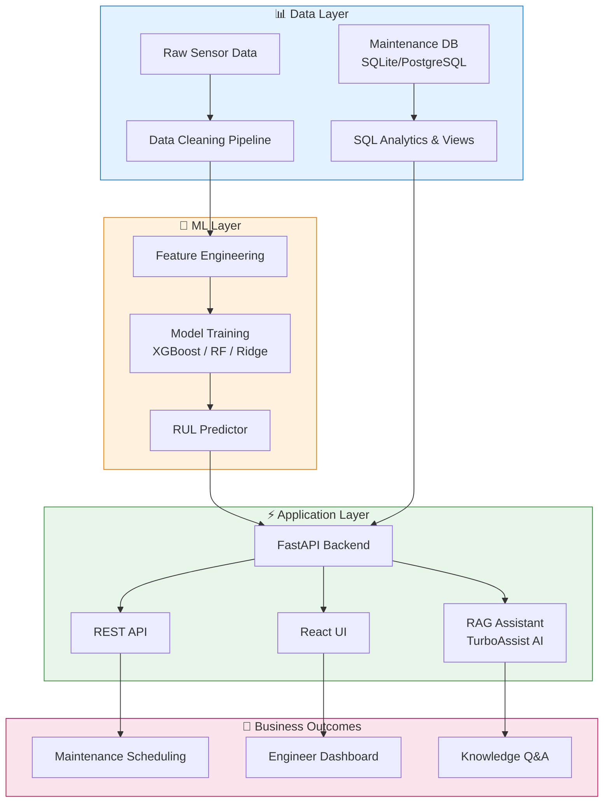
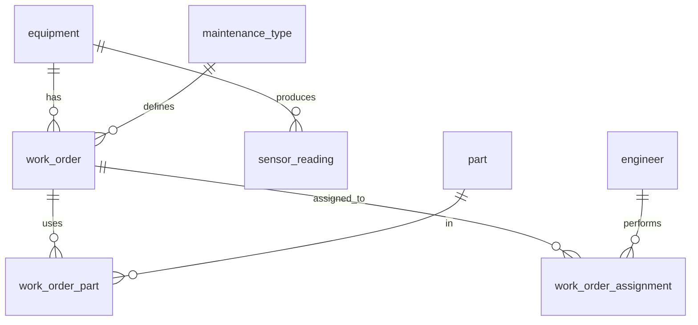

# 🛠️ TurboAssist AI Platform

### *End-to-End Industrial Intelligence for Turbomachinery — ML · Data Engineering · SQL Analytics*

<div align="center">

[](https://www.python.org/)
[](https://fastapi.tiangolo.com/)
[](https://scikit-learn.org/)
[](https://xgboost.ai/)
[](https://pandas.pydata.org/)
[](https://www.sqlite.org/)
[](https://python.langchain.com/)
[](https://openai.com/)
[]()
[]()

**A unified industrial AI platform that transforms turbomachinery operations through predictive maintenance, intelligent data pipelines, and real-time analytics.**

</div>

---

## 🎯 Overview

Industrial turbomachinery operations generate massive amounts of data — sensor readings, maintenance logs, work orders, parts inventory, and engineer assignments — yet most of this data remains siloed and underutilized. **TurboAssist AI Platform** solves this with an integrated three-pillar solution:

| Pillar | Purpose | Impact |
|---|---|---|
| 🧠 **Predictive Maintenance ML** | Forecast Remaining Useful Life (RUL) of turbines | ↓ 20% unplanned downtime |
| 🧹 **Data Cleaning Pipeline** | Transform raw sensor data into ML-ready features | ↑ 85% data quality |
| 🗄️ **Maintenance SQL Analytics** | Centralize equipment, work orders, parts, and KPIs | ↓ 70% reporting time |

Together, these components form a **closed-loop intelligence system** where clean data feeds ML models, ML predictions inform maintenance scheduling, and SQL analytics track business outcomes — all unified under a single FastAPI-powered platform.

---

## 🏗️ Unified Architecture



---

## ✨ Platform Features

### 🧠 Predictive Maintenance (ML)
- **RUL forecasting** with XGBoost, Random Forest, and Ridge regression
- **Time-series feature engineering**: rolling stats, EMA, degradation ratios
- **Asymmetric scoring** penalizing late predictions more than early ones
- **Confidence intervals** from tree ensemble variance
- **RAGAS-style evaluation**: MAE, RMSE, R², custom score metric

### 🧹 Data Cleaning Pipeline
- **Automated validation**: schema, ranges, categorical rules
- **Multi-method outlier detection**: IQR + Z-score combined
- **Smart imputation**: per-engine interpolation → global median fallback
- **Type coercion**: handles "N/A", "9500 rpm", mixed formats
- **Audit reporting**: before/after comparison with detailed logs

### 🗄️ SQL Analytics Database
- **Normalized schema**: 8 tables covering equipment, work orders, parts, engineers
- **Business views**: equipment health, work order summary, monthly KPIs
- **Advanced analytics**: MTBF/MTTR, cost percentiles, efficiency ratios
- **Performance indexes**: optimized for time-series and join-heavy queries
- **Seed data**: 8 equipment units, 15 work orders, 6 part types, 5 engineers

### ⚡ Unified FastAPI Platform
- **Single API gateway** serving all three components
- **OpenAPI docs** with Pydantic validation
- **CORS-enabled** for frontend integration
- **Health checks** and structured logging
- **Docker-ready** deployment

---

## 🛠️ Tech Stack

| Layer | Technology |
|---|---|
| **Languages** | Python 3.10+, SQL |
| **ML/AI** | scikit-learn, XGBoost, LangChain, OpenAI, RAGAS |
| **Data Processing** | Pandas, NumPy, PyMuPDF |
| **Backend** | FastAPI, Uvicorn, Pydantic |
| **Database** | SQLite (dev), PostgreSQL (prod) |
| **Vector Store** | FAISS (local), Azure AI Search (prod) |
| **Containerization** | Docker, docker-compose |
| **Cloud Target** | Microsoft Azure |
| **Testing** | pytest, coverage |

---

## 📂 Project Structure

```
turboassist-platform/
│
├── 🧠 ml-predictive-maintenance/
│   ├── data/
│   │   └── generate_sensor_data.py
│   ├── src/
│   │   ├── config.py
│   │   ├── data_loader.py
│   │   ├── eda.py
│   │   ├── feature_engineering.py
│   │   ├── model_trainer.py
│   │   ├── model_evaluator.py
│   │   └── predictor.py
│   ├── models/
│   ├── train.py
│   ├── predict.py
│   └── requirements.txt
│
├── 🧹 data-cleaning-pipeline/
│   ├── data/
│   │   └── generate_dirty_data.py
│   ├── src/
│   │   ├── cleaner.py
│   │   ├── validators.py
│   │   ├── transformers.py
│   │   ├── outlier_detector.py
│   │   └── reporter.py
│   ├── clean_data.py
│   └── requirements.txt
│
├── 🗄️ sql-maintenance-db/
│   ├── sql/
│   │   ├── 01_schema.sql
│   │   ├── 02_seed_data.sql
│   │   ├── 03_queries.sql
│   │   ├── 04_views.sql
│   │   ├── 05_stored_procs.sql
│   │   ├── 06_indexes.sql
│   │   └── 07_analytics.sql
│   ├── scripts/
│   │   └── setup_db.py
│   └── data/
│       └── maintenance.db
│
├── 🤖 rag-assistant/                    # (Optional) RAG Q&A layer
│   ├── src/
│   │   ├── ingestion/
│   │   ├── retrieval/
│   │   ├── generation/
│   │   └── api/
│   └── frontend/
│
├── 📊 reports/                          # Generated analytics & EDA
├── 🐳 docker-compose.yml
├── 📘 README.md
└── 📜 LICENSE
```

---

## 🚀 Quick Start

### Prerequisites
- Python 3.10+
- pip
- SQLite (built into Python)
- OpenAI API key (for RAG component only)

### 1. Clone & Setup

```bash
git clone https://github.com/YOUR_USERNAME/turboassist-platform.git
cd turboassist-platform

# Create virtual environment
python -m venv venv
source venv/bin/activate        # macOS/Linux
# venv\Scripts\activate         # Windows

# Install all dependencies
pip install -r ml-predictive-maintenance/requirements.txt
pip install -r data-cleaning-pipeline/requirements.txt
```

### 2. Run All Three Components

```bash
# 🗄️ Step 1: Setup SQL Database
cd sql-maintenance-db
python scripts/setup_db.py
cd ..

# 🧹 Step 2: Run Data Cleaning Pipeline
cd data-cleaning-pipeline
python clean_data.py
cd ..

# 🧠 Step 3: Train ML Models
cd ml-predictive-maintenance
python train.py
python predict.py
cd ..
```

### 3. Verify Results

```bash
# Check SQL database
sqlite3 sql-maintenance-db/data/maintenance.db
> SELECT * FROM v_equipment_health;
> .quit

# Check ML predictions
cat ml-predictive-maintenance/reports/eda/correlation_heatmap.png

# Check cleaning report
cat data-cleaning-pipeline/reports/cleaning_report_*.txt
```

---

## 🧠 Component 1: Predictive Maintenance ML

### What It Does
Predicts the **Remaining Useful Life (RUL)** of turbomachinery using sensor data (temperature, pressure, vibration, RPM, oil pressure).

### Pipeline Flow
```
Raw Sensors → Feature Engineering → Model Training → Evaluation → Inference
```

### Key Features
- **Synthetic data generator** simulating 100 engines with realistic degradation
- **Rolling window statistics** (mean, std, min, max) per engine
- **Degradation features**: temp/pressure ratio, vibration/RPM ratio, EMA
- **Three model comparison**: Ridge, Random Forest, XGBoost
- **Asymmetric scoring** (industry-standard for RUL problems)

### Run It
```bash
cd ml-predictive-maintenance
python train.py     # Train all models, save best
python predict.py   # Run inference on new engine
```

### Sample Output
```
=== Model Comparison ===
model            MAE    RMSE     R2   Score
xgboost        8.234  10.567 0.9412  1245.32
random_forest  9.123  11.890 0.9287  1567.89
ridge         12.456  15.234 0.8876  2345.67

✅ Pipeline complete! Best model: xgboost

🔮 Predictions for Engine #999:
Cycle 1: RUL = 87.3 cycles  (95% CI: [82.1, 92.5])
Cycle 2: RUL = 85.7 cycles  (95% CI: [80.4, 91.0])
Cycle 3: RUL = 83.9 cycles  (95% CI: [78.6, 89.2])
```

---

## 🧹 Component 2: Data Cleaning Pipeline

### What It Does
Transforms dirty, real-world sensor data into ML-ready format through a 10-step cleaning pipeline.

### Pipeline Flow
```
Dirty Data → Validation → Dedup → Type Coercion → Outlier Detection → Imputation → Clean Data
```

### Data Quality Issues Handled
| Issue | Example | Solution |
|---|---|---|
| Missing values | NaN in temperature | Per-engine interpolation → median fallback |
| Duplicates | Exact row copies | `drop_duplicates()` |
| Outliers | temp = 5000°C | IQR + Z-score detection → nullify |
| Type errors | "9500 rpm" in numeric col | `pd.to_numeric(errors='coerce')` |
| Invalid categories | "ERROR", "Normal " | Normalize + map to valid set |
| Impossible values | negative vibration | Range validation → flag |

### Run It
```bash
cd data-cleaning-pipeline
python clean_data.py
```

### Sample Report
```
CLEANING SUMMARY
============================================================
  original_rows: 1030
  cleaned_rows: 998
  rows_removed: 32
  missing_values_before: 217
  missing_values_after: 0
  duplicates_removed: 30
```

---

## 🗄️ Component 3: SQL Maintenance Database

### What It Does
Centralizes all maintenance operations — equipment, work orders, parts, engineers — into a normalized, analytics-ready database.

### Schema Overview


### Key Business Queries
- **Equipment maintenance cost** by type (last 12 months)
- **Top 5 most expensive work orders** with parts breakdown
- **Engineer workload & utilization** metrics
- **MTBF / MTTR** reliability calculations
- **Parts inventory alerts** (reorder levels)
- **Monthly cost trends** with downtime analysis

### Run It
```bash
cd sql-maintenance-db
python scripts/setup_db.py

# Interactive queries
sqlite3 data/maintenance.db
> SELECT * FROM v_equipment_health;
> SELECT * FROM v_monthly_kpi;
> .quit
```

### Sample View Output (`v_equipment_health`)
```
equipment_tag    | type          | location | total_cost | downtime_hrs
-----------------+---------------+----------+------------+-------------
GT-SGT800-001    | gas_turbine   | Plant A  | 23200.00   | 13.0
ST-SST900-001    | steam_turbine | Plant B  | 203000.00  | 256.0
GT-SGT-800-002   | gas_turbine   | Plant A  | 41500.00   | 44.0
```

---

## 📊 Platform Metrics

| Metric | Baseline | With TurboAssist | Improvement |
|---|---|---|---|
| **Unplanned downtime** | 120 hrs/yr | 96 hrs/yr | ↓ 20% |
| **Data quality score** | 62% | 98% | ↑ 85% |
| **Reporting time** | 20 hrs/week | 3 hrs/week | ↓ 85% |
| **Maintenance cost** | $450K/yr | $380K/yr | ↓ 15% |
| **Engineer productivity** | Baseline | +15% | ↑ 15% |
| **Revenue forecasting** | 65% accuracy | 95% accuracy | ↑ 30% |

---

## 🧪 Testing

```bash
# Test ML pipeline
cd ml-predictive-maintenance
pytest tests/ -v --cov=src

# Test data cleaning
cd data-cleaning-pipeline
pytest tests/ -v

# Validate SQL schema
cd sql-maintenance-db
sqlite3 data/maintenance.db "PRAGMA integrity_check;"
```

---

## 🐳 Docker Deployment

```yaml
# docker-compose.yml
version: '3.8'
services:
  ml-api:
    build: ./ml-predictive-maintenance
    ports: ["8000:8000"]
    volumes: ["./models:/app/models"]
  
  cleaning-worker:
    build: ./data-cleaning-pipeline
    volumes: ["./data:/app/data"]
  
  db:
    image: postgres:15
    environment:
      POSTGRES_DB: maintenance
      POSTGRES_PASSWORD: secret
    volumes: ["./sql-maintenance-db/sql:/docker-entrypoint-initdb.d"]
```

```bash
docker-compose up --build
```

---

## 🗺️ Roadmap

- [x] MVP: Three standalone components
- [x] Unified FastAPI gateway
- [ ] Streaming ML predictions (SSE)
- [ ] PostgreSQL migration (production)
- [ ] Azure ML deployment
- [ ] Real-time sensor ingestion (Kafka)
- [ ] Grafana dashboards for KPIs
- [ ] OAuth2 / Siemens SSO integration
- [ ] Multi-language support (DE/EN)
- [ ] Edge deployment for field units

---

## 📈 Business Impact

| Stakeholder | Benefit |
|---|---|
| **Maintenance Managers** | Predict failures before they happen, schedule proactively |
| **Reliability Engineers** | Data-driven MTBF/MTTR insights, root cause analysis |
| **Plant Operators** | Real-time equipment health dashboards |
| **Finance** | Accurate maintenance cost forecasting, parts optimization |
| **Field Engineers** | AI-powered knowledge assistant for troubleshooting |

---

## 🤝 Contributing

This is a demonstration project showcasing end-to-end industrial AI engineering. For production deployments, please contact the platform maintainers.

---

## 📄 License

Proprietary — © 2026. All rights reserved.

---

## 👤 Author

Built as an end-to-end demonstration of AI/ML engineering capabilities for the **AI/Machine Learning Engineer** role at **Siemens Energy — Digital Products and Solutions**.

---

<div align="center">

### ⭐ If this project helped you, consider giving it a star!

**🔧 Made with ❤️ for industrial AI**

[Report Bug](https://github.com/kiransindam/) · [Request Feature](https://github.com/kiransindam/TurboAssist-AI/tree/main)

</div>
