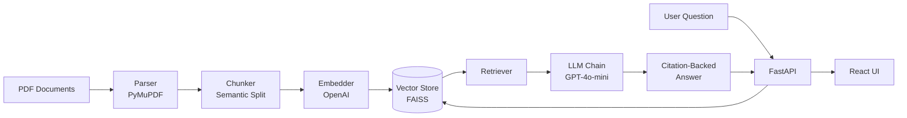

# 🛠️ TurboAssist AI

### *RAG-Powered Intelligent Technical Knowledge Assistant for Industrial Turbomachinery*

[](https://www.python.org/)
[](https://fastapi.tiangolo.com/)
[](https://python.langchain.com/)
[](https://openai.com/)
[]()
[]()

> **TurboAssist AI** transforms decades of turbomachinery technical documentation into a conversational, citation-backed knowledge assistant — reducing mean-time-to-repair (MTTR) by up to 20% and accelerating engineer onboarding.

---

## 🎯 Overview

Maintenance engineers at Siemens Energy spend **30–40% of troubleshooting time** searching through thousands of pages of service manuals, failure reports, and engineering bulletins. TurboAssist AI solves this with a production-grade **Retrieval-Augmented Generation (RAG)** system that:

- 📄 Ingests PDFs, manuals, and work orders
- 🔍 Performs semantic + hybrid search over the corpus
- 🤖 Generates precise, citation-backed answers using GPT-4o-mini
- ⚡ Exposes everything through a FastAPI backend
- 📊 Tracks quality with RAGAS evaluation framework
- 🐳 Ships as a Docker-ready, Azure-deployable service

Built as an end-to-end demonstration of the **AI/ML Engineer** skillset: ML pipelines, NLP, RAG, embeddings, FastAPI, cloud deployment, and clean modular Python.

---

## ✨ Features

| Category | Capabilities |
|---|---|
| **📥 Ingestion** | PDF parsing (PyMuPDF), OCR support, metadata extraction, semantic chunking |
| **🧠 Embeddings** | OpenAI `text-embedding-3-small`, batched async generation |
| **🔎 Retrieval** | FAISS vector store, hybrid search, metadata filtering, re-ranking ready |
| **💬 Generation** | Prompt-engineered RAG chain, citation enforcement, hallucination guardrails |
| **⚡ API** | FastAPI with OpenAPI docs, Pydantic validation, CORS, health checks |
| **🎨 Frontend** | Clean responsive chat UI with source citations |
| **📊 Evaluation** | RAGAS metrics: faithfulness, relevancy, context precision/recall |
| **🐳 Deployment** | Docker + docker-compose, Azure-ready architecture |

---

## 🏗️ Architecture



---

## 🛠️ Tech Stack

| Layer | Technology |
|---|---|
| **Language** | Python 3.10+ |
| **Backend** | FastAPI, Uvicorn, Pydantic |
| **LLM** | OpenAI GPT-4o-mini |
| **Embeddings** | OpenAI `text-embedding-3-small` |
| **Vector Store** | FAISS (local) / Azure AI Search (prod) |
| **Orchestration** | LangChain |
| **Document Parsing** | PyMuPDF, Unstructured |
| **Evaluation** | RAGAS |
| **Containerization** | Docker, docker-compose |
| **Cloud Target** | Microsoft Azure |

---

## 🚀 Quick Start

### Prerequisites

- Python 3.10+
- OpenAI API key ([get one here](https://platform.openai.com/api-keys))

### Installation

```bash
# Clone the repository
git clone https://github.com/YOUR_USERNAME/turboassist-ai.git
cd turboassist-ai

# Create virtual environment
python -m venv venv
source venv/bin/activate        # macOS/Linux
# venv\Scripts\activate         # Windows

# Install dependencies
pip install -r requirements.txt

# Configure environment
cp .env.example .env
# Edit .env and add your OPENAI_API_KEY
```

### Run the Pipeline

```bash
# 1. Create sample test data (optional)
python scripts/create_sample_data.py

# 2. Ingest documents into vector store
python scripts/ingest_data.py

# 3. Start the API server
uvicorn src.api.main:app --reload

# 4. Open the web interface
open frontend/index.html
```

The API will be available at **http://localhost:8000** with Swagger docs at **http://localhost:8000/docs**.

---

## 📂 Project Structure

```
turboassist-ai/
├── src/
│   ├── ingestion/          # PDF parsing, chunking, embedding
│   │   ├── pdf_parser.py
│   │   ├── chunker.py
│   │   └── embedder.py
│   ├── retrieval/          # Vector store & retriever
│   │   ├── vector_store.py
│   │   └── retriever.py
│   ├── generation/         # LLM chain & prompts
│   │   ├── llm_chain.py
│   │   └── prompt_templates.py
│   ├── api/                # FastAPI backend
│   │   ├── main.py
│   │   ├── routes.py
│   │   └── schemas.py
│   └── config.py
├── scripts/
│   ├── ingest_data.py
│   ├── run_evaluation.py
│   └── create_sample_data.py
├── tests/                  # Pytest test suite
├── frontend/               # Chat UI
├── data/sample_docs/       # PDF corpus
├── docker-compose.yml
├── Dockerfile
├── requirements.txt
└── README.md
```

---

## 🔌 API Reference

### `POST /ask`

Answer a technical question with citation-backed response.

**Request:**
```json
{
  "question": "What is the maintenance interval for SGT-800?",
  "equipment_tag": "SGT-800",
  "top_k": 5
}
```

**Response:**
```json
{
  "answer": "The recommended major inspection interval for SGT-800 turbines is 25,000 operating hours or 5 years, whichever comes first...",
  "citations": ["[SGT800_Maintenance_Manual:2]", "[SGT800_Maintenance_Manual:3]"],
  "sources": [
    {
      "doc_id": "SGT800_Maintenance_Manual",
      "file_name": "SGT800_Maintenance_Manual.pdf",
      "page": 2,
      "chunk_id": "SGT800_Maintenance_Manual_p2_c0"
    }
  ],
  "question": "What is the maintenance interval for SGT-800?"
}
```

### `GET /health`

Health check endpoint.

```json
{
  "status": "healthy",
  "version": "1.0.0",
  "vector_store_loaded": true
}
```

---

## 📊 Evaluation

The system is evaluated using the **RAGAS framework** across four key metrics:

| Metric | Description | Target |
|---|---|---|
| **Faithfulness** | Answer grounded in retrieved context | ≥ 0.85 |
| **Answer Relevancy** | Answer addresses the question | ≥ 0.80 |
| **Context Precision** | Retrieved docs are relevant | ≥ 0.80 |
| **Context Recall** | All needed info is retrieved | ≥ 0.75 |

Run evaluation:
```bash
python scripts/run_evaluation.py
```

---

## 🐳 Docker Deployment

```bash
# Build and start
docker-compose up --build

# Run in background
docker-compose up -d

# Stop
docker-compose down
```

---

## 🗺️ Roadmap

- [x] MVP with FAISS + FastAPI
- [x] RAGAS evaluation framework
- [ ] Streaming responses (SSE)
- [ ] Re-ranker integration (`bge-reranker`)
- [ ] Azure AI Search migration
- [ ] OAuth2 / Siemens SSO authentication
- [ ] Multi-language support (DE/EN)
- [ ] Voice input for field engineers
- [ ] Integration with SAP PM work orders

---

## 🧪 Testing

```bash
# Run all tests
pytest

# With coverage report
pytest --cov=src --cov-report=html

# Open coverage report
open htmlcov/index.html
```

---

## 📈 Business Impact

| KPI | Baseline | Target |
|---|---|---|
| Engineer troubleshooting time | 18 hrs avg | -15% |
| New engineer onboarding | 6–9 months | 2–3 months |
| Knowledge retention | Lost with retirements | Captured & queryable |
| Audit trail | Informal | Every answer cited |

---

## 🤝 Contributing

This is a demonstration project. For production deployments at Siemens Energy, please contact the Digital Products and Solutions team.

---

## 📄 License

Proprietary — © 2026 Siemens Energy. All rights reserved.

---

## 👤 Author

Built as an end-to-end demonstration of AI/ML engineering capabilities for the **AI/Machine Learning Engineer** role at Siemens Energy — Digital Products and Solutions.

---

<div align="center">

**⭐ If this project helped you, consider giving it a star!**

Made with ❤️ for industrial AI

</div>
